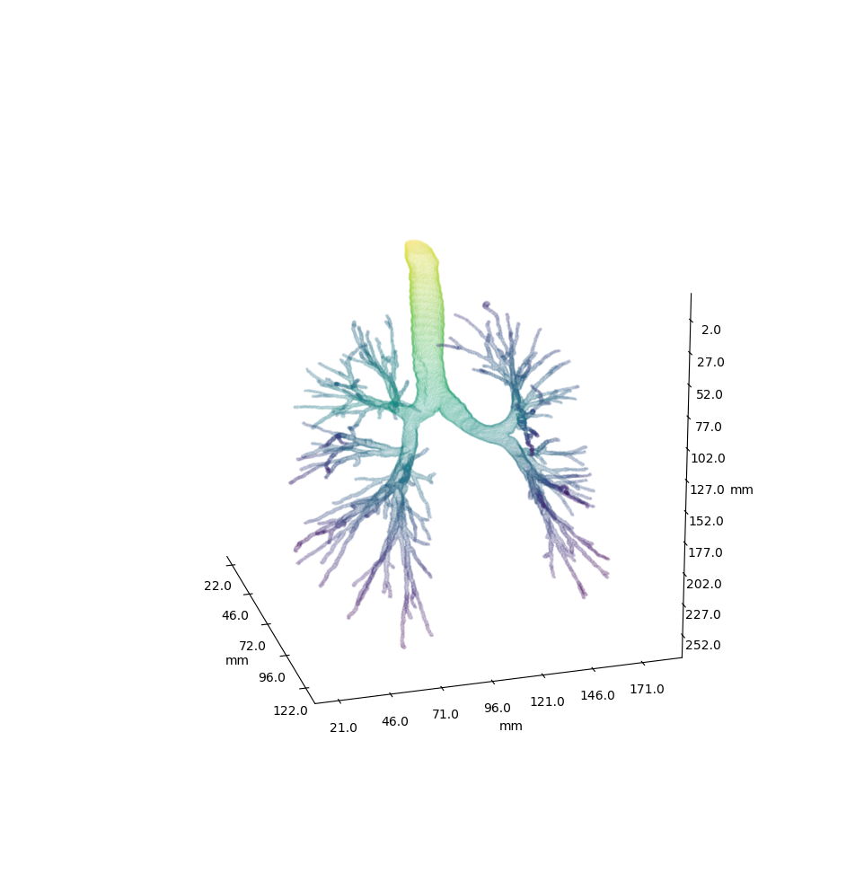
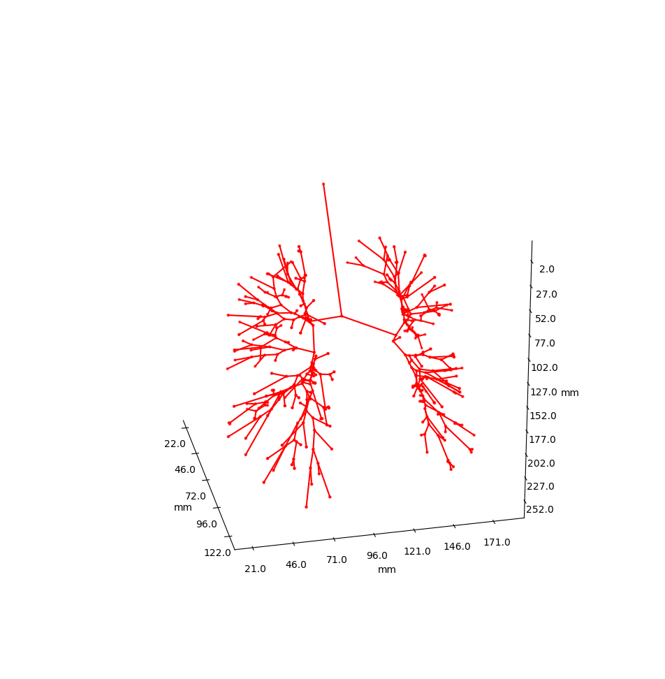
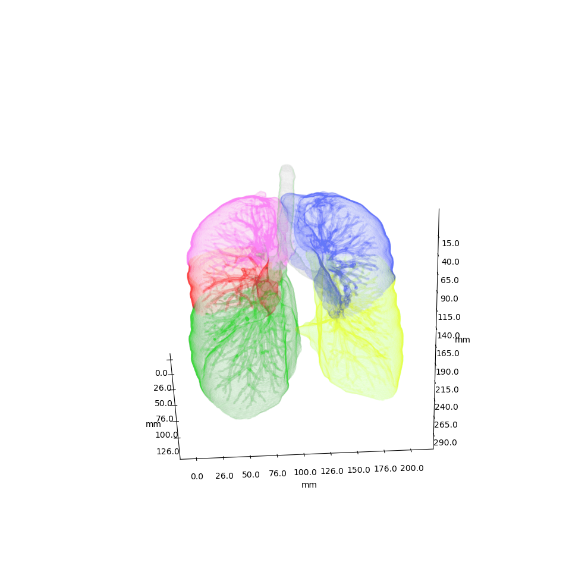
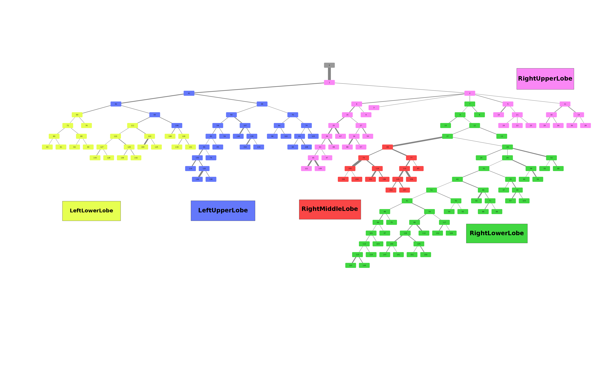
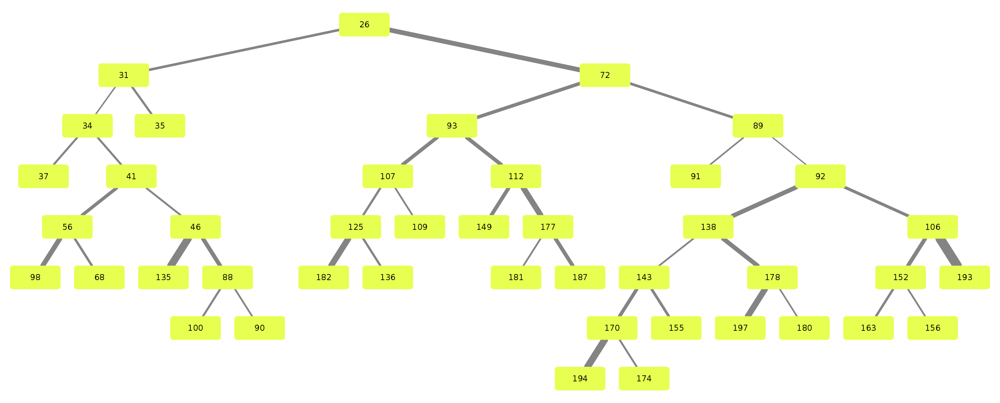
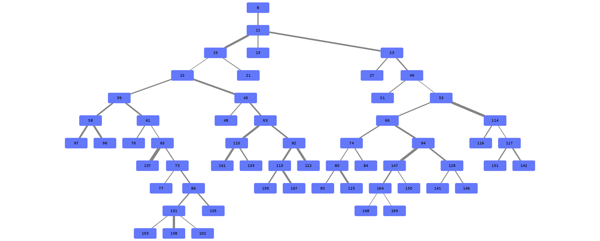

# Airway

Airway is a project which analyses the anatomy of the lung bronchus by viewing it as a tree and looking for unusual structures.

Airway originated as a student project at the University of Rostock, most contributions coming from [Martin](https://github.com/meetunix) and me. 
Half a year later I'm continuing this project as my bachelor project. 

## Working with the data

We use a pipeline based approach to calculate the raw data. With the help of
`airway-pipeline.py` you are able to calculate each step (called stages) separately or
all at once.

Everything happens in a directory of your choice. 
Prerequisites are the raw data and the filesystem structure of the raw data. 

Here is how the data has to be defined. Note that raw\_data should be formatted
to raw\_airway by you as we do not know your initial data structure. 
We do provide a script which handled our case, you can find it in 
`scripts/separate-bronchus-files.sh`.

```
	DATADIR
	├── raw_data				<- This is the entirely unformatted raw data 
	│   └── Ct_Thorax_Standard_Mit_Km - 3123156
	│       ├── DATA
	│       │   ├── Data.txt 		<- This contained the paths for finding the various bronchus and lobes
	│       │   └── 3123156			<- Example Patient ID
	│       │       └── 20190101
	│       │           └── 931235
	│       │               └── EX1
	│       │                   ├── SE1
	│       │                   ├── SE10
	│       │                   ├── SE11
	│       │                   ├── SE2
	│       │                   ├── SE3
	│       │                   ├── SE4
	│       │                   ├── SE5
	│       │                   ├── SE6
	│       │                   ├── SE7
	│       │                   ├── SE8
	│       │                   └── SE9
	├── raw_airway 				<- Formatted data which will be used as input for stage-01
	│   └── 3123156
	│       ├── Artery
	│       ├── Bronchus
	│       ├── Koerperstamm
	│       ├── LeftLowerLobe
	│       ├── LeftUpperLobe
	│       ├── RightLowerLobe
	│       ├── RightMiddleLobe
	│       ├── RightUpperLobe
	│       └── Vein
	├── stage-01
	│   ├── 3123156
	│   └── ...
	├── stage-02
	│   ├── 3123156
	│   └── ...
	...

```


For every calculated stage `airway-pipeline` creates a new directory (stage-xx) and subdirectories for each patient (e.g. 3123156):

Let us calculate stage 1:

`airway-pipeline -p /FULL/PATH/TO/DATADIR -s 1`

airway-pipeline checks if the stage is already existing, if you need to overwrite
a stage you need to add the `-f` flag.

If you want more than one stage use the following syntax:

`airway-pipeline -p /FULL/PATH/TO/DATADIR -s 1 -s 2 -s 4 -s 3`


By default four patients will be calculated in parallel (4 workers are used). If you have more cpu cores,
simply increase the number of workers:

`airway-pipeline -p /FULL/PATH/TO/DATADIR -s 1 -s 2 -w 32` 


## What do the stages mean?

Stages 1 through 9 are responsible for generation of the bronchus tree splits.

Stage 10 through 19 are responsible for tree analysis.

Stages 20 through 29 are responsible for visualisation.

TODO: out of date










## Example trees for patient 3183090






