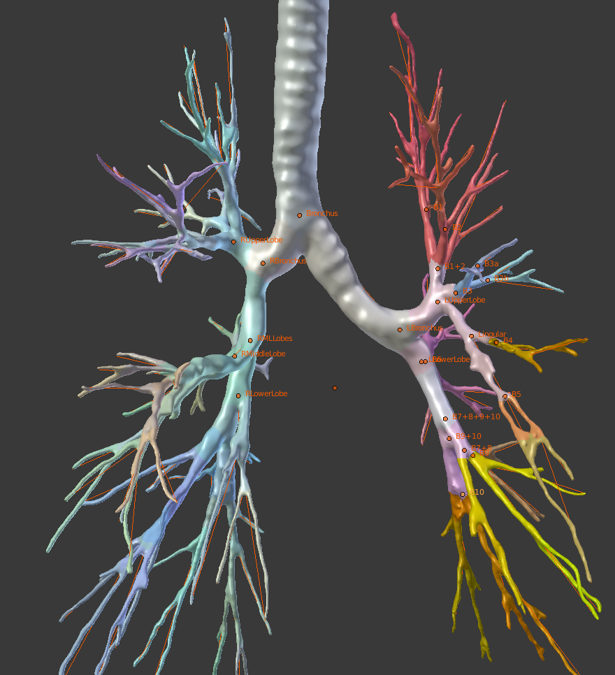
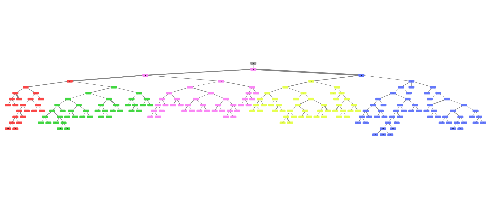
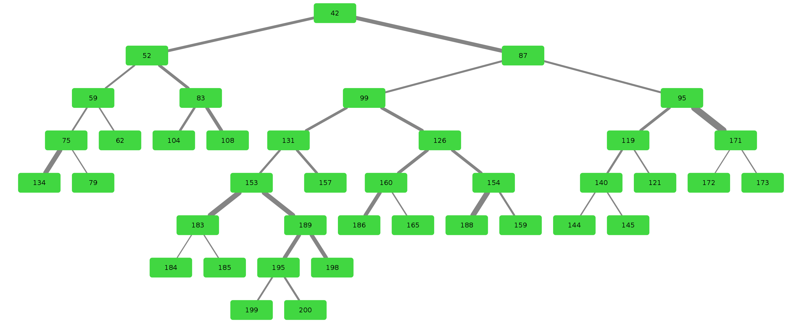
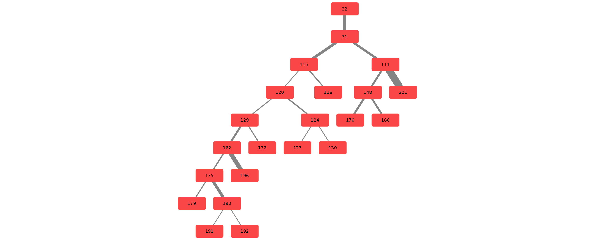
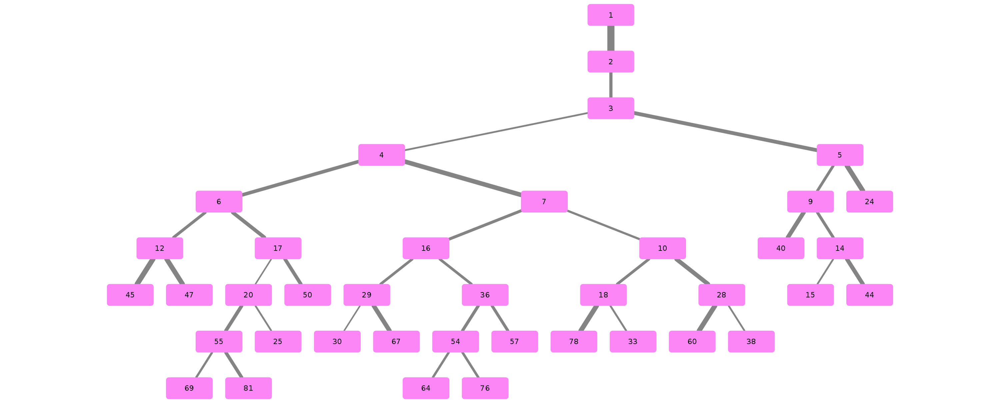

# Airway

Anatomical segmentation and classification of human lung bronchus based on high-quality CT images.
Using a rule-based approach to the classification yields reasonable results as this approach does not differ all that much in comparison to what a surgeon does.

Specifically the left upper lobe (in the below image marked as, red, blue and gold) has been used as research focus as there are unusual split structures worth looking into according to Dr. Rolf Oerter.




Example visualisation of split detection, rendered with blender.

This project is WIP and currently very actively in development!

## Installation

At least Python 3.6 is required for this project.

```pip3 install -r requirements.txt```

These are required for certain stages:

```apt install blender python3-igraph```

Now you can run this for the possible commands to use with airway pipeline.

```python3 airway-pipeline.py -h```

## Working with the data

We use a pipeline based approach to calculate the raw data. With the help of
`airway-pipeline.py` you are able to calculate each step (called stages) separately or
all at once.

Everything happens in a directory of your choice. 
Prerequisites are the raw data and the filesystem structure of the raw data. 

Here is how the data has to be defined. Note that raw\_data should be formatted
to raw\_airway by you as we do not know your initial data structure. 
We do provide a script which handled our case, you can find it in 
`scripts/separate-bronchus-files.sh`.

```
    DATADIR
    ├── raw_data                    <- This is the entirely unformatted raw data 
    │   └── Ct_Thorax_Standard_Mit_Km - 3123156
    │       ├── DATA
    │       │   ├── Data.txt        <- This contained the paths for finding the various bronchus and lobes
    │       │   └── 3123156         <- Example Patient ID
    │       │       └── ...         <- Some folder structure with the data
    ├── raw_airway                  <- Formatted data which will be used as input for stage-01
    │   └── 3123156                 
    │       ├── Artery
    │       ├── Bronchus
    │       ├── Koerperstamm
    │       ├── LeftLowerLobe
    │       ├── LeftUpperLobe
    │       ├── RightLowerLobe
    │       ├── RightMiddleLobe
    │       ├── RightUpperLobe
    │       └── Vein
    ├── stage-01                    <- Each stage now has the same basic format
    │   ├── 3123156
    │   └── ...
    ├── stage-02
    │   ├── 3123156
    │   └── ...
    ...

```

After you have created the raw_airway folder structure, you can use the `airway-pipeline.py` script to create various stages.

To do this rename `example_defaults.yaml` to `defaults.yaml` and change the path in the file to where you have put the data.
You may ignore the other parameters for now.

For every calculated stage `airway-pipeline.py` creates a new directory (stage-xx) and subdirectories for each patient (e.g. 3123156).


Let us calculate stage 1:

`./airway-pipeline.py 1`

The airway pipeline checks if the stage already exists, if you need to overwrite
a stage you need to add the `-f`/`--force` flag.

Here are some other possible ways to define stages:

`./airway-pipeline.py 1 3-5 7+` - will create stages 1, 3, 4, 5, 7 and all the ones above 7
`./airway-pipeline.py tree vis` - will create stages which are in the groups tree and vis
`./airway-pipeline.py all` - will create all stages


By default four patients will be calculated in parallel (4 workers are used). 
If you have more CPU threads, simply increase the number of workers:

`./airway-pipeline.py 1 2 3 -w 32` or change the default in the config file (`defaults.yaml`).


## Stages

You can type `./airway-pipeline --stages` for this description as well:

Stages 1 through 7 use the raw data to create the tree splits used in the rest of the stages.

Stage 30 through 34 analyse the tree structure, focusing mostly on the left upper lobe.

Stages 60 through 62 are 3D visualisations, wherein .obj files of the lungs are exported.

Stages 70 through 72 are plot visualisations of various stats.

Stage 90 is the website which displays information for each patient including the 3D models.


## Example trees for patient 3183090








# Credits & Thanks to

Airway originated as an observation by Dr. Rolf Oerter at the University of Rostock that certain structures in the lungs bronchus he has seen while operating have not been documented. 
The first steps of the project were made as a student project at the University of Rostock at the Department of Systems Biology organised by Mariam Nassar. 

It consisted of this Team:

- [Martin Steinbach](https://github.com/meetunix)
- [Brutenis Gliwa](https://github.com/liquidfun)
- Lukas Großehagenbrock
- Jonas Moesicke
- Joris Thiele

After this, the project is being continued by me (Brutenis) as my bachelor thesis. 
Thanks to Mariam Nassar, Gundram Leifert and Prof. Olaf Wolkenhauer for supervision during this time.
And thanks to Planet AI for letting me write my thesis at their office.

